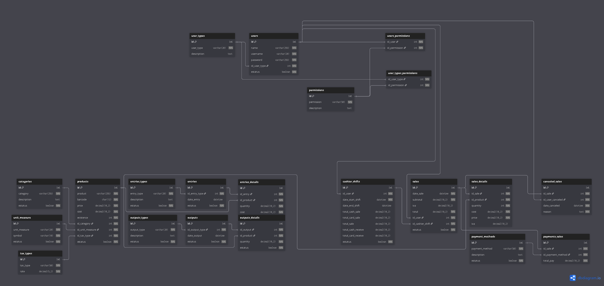

# Database Design

## ER Diagram


## Description
- **Users**: stores user credentials, type of user and the permissions of functions in POS to user can do it.
- **Inventory**: stores product information and stock.
- **Sales**: store all the payment methods, transactions and cancellation of the sales.

## Tables (Summary)
| Group         | Table                    | Description                                              |
| ------------- | ------------------------ | -------------------------------------------------------- |
| **Users**     | `users`                  | Stores user credentials and personal info.               |
|               | `user_types`             | Defines user roles (e.g., admin, cashier).               |
|               | `permissions`            | Defines available system permissions.                    |
|               | `user_types_permissions` | Links user types to permissions.                         |
|               | `users_permissions`      | Links individual users to specific permissions.          |
| **Inventory** | `categories`             | Groups products by category.                             |
|               | `unit_measure`           | Defines units of measurement (e.g., kg, pcs, lt).        |
|               | `tax_types`              | Defines tax classifications and rates (IVA, exempt, 0%). |
|               | `products`               | Contains product details, prices, taxes, and stock.      |
|               | `entries_types`          | Defines types of stock entries (purchase, gift, etc.).   |
|               | `entries`                | Records each inventory entry transaction.                |
|               | `entries_details`        | Stores products and quantities for each entry.           |
|               | `outputs_types`          | Defines types of stock outputs (losses, gifts, etc.).    |
|               | `outputs`                | Records each inventory output transaction.               |
|               | `outputs_details`        | Stores products and quantities for each output.          |
| **Sales**     | `cashier_shifts`         | Tracks each cashier’s working period and totals.         |
|               | `sales`                  | Stores general sale information (totals, user, date).    |
|               | `sales_details`          | Contains products sold in each sale.                     |
|               | `canceled_sales`         | Records canceled sales and reasons.                      |
|               | `payment_methods`        | Defines available payment methods.                       |
|               | `payments_sales`         | Links sales with payment methods and amounts.            |

## ERD Source (dbdiagram.io JSON)
The following code can be imported directly into [dbdiagram.io](https://dbdiagram.io) to visualize and edit the database model.

```json

Table permissions {
  id int [pk, increment]
  permission varchar(50) [not null] // Example: Create users, Sales, Add products.
  description text
}

Table user_types {
  id int [pk, increment]
  user_type varchar(20) [not null, unique] // Example: Supervisor, cashier.
  description text
}

Table users {
  id int [pk, increment]
  name varchar(255) [not null]
  username varchar(20) [not null, unique] 
  password varchar(255) [not null, note: 'Encrypted']
  id_user_type int [not null]
  estatus boolean [not null, default: true]
  indexes {
    id_user_type
    estatus
  }
}

Ref: users.id_user_type > user_types.id

// An user have default permissions, because his user type. 
Table user_types_permissions {
  id_user_type int [not null]
  id_permission int [not null]
  indexes {
    (id_permission, id_user_type)
    id_user_type
    id_permission
  }
}

Ref: user_types_permissions.id_user_type > user_types.id
Ref: user_types_permissions.id_permission > permissions.id

// An user can have and configure additional permisions are not
// available in his user type if is necessary
Table users_permissions {
  id_user int [not null]
  id_permission int [not null]
  indexes {
    (id_permission, id_user)
    id_user
    id_permission
  }
}

Ref: users_permissions.id_user > users.id
Ref: users_permissions.id_permission > permissions.id

TableGroup users {
  user_types
  users
  user_types_permissions
  users_permissions
}


Table categories {
  id int [pk, increment]
  category varchar(255) [not null, unique] // Example: Drinks, Candys, Personal Hygiene
  description text
  estatus boolean [not null, default: true]
  indexes {
    estatus
  }
}

Table unit_measure {
  id int [pk, increment]
  unit_measure varchar(20) [not null, unique] // Example: Liter, Kilograms, Libras
  symbol varchar(10) [not null, unique] // Example: Lt, Kg, Lbs.
  estatus boolean [not null, default: true]
  indexes {
    estatus
  }
}

Table tax_types {
  id int [pk, increment]
  tax_type varchar(50) [not null, unique] // Example: IVA, Exempt IVA, 0%
  rate decimal(5,2) [not null] // Example: 16.00, 0.00
}


Table products {
  id int [pk, increment]
  product varchar(255) [not null, unique]
  barcode char(13) [not null, unique]
  price decimal(10,2) [not null]
  cost decimal (10,2) [not null]
  existence int [not null]
  id_category int [not null]
  id_unit_measure int [not null]
  id_tax_type int [not null]
  estatus boolean [not null, default: true]
  indexes {
    barcode
    id_category
    id_unit_measure
    id_tax_type
    estatus
  }
}

Ref: products.id_category > categories.id
Ref: products.id_unit_measure > unit_measure.id
Ref: products.id_tax_type > tax_types.id

Table entries_types {
  id int [pk, increment]
  entry_type varchar(20) [not null, unique] //Example:  Purchase, bonus.
  description text
  estatus boolean [not null, default: true]
  indexes {
    estatus
  }
}

Table entries {
  id int [pk, increment]
  id_entry_type int [not null]
  date_entry datetime [default: 'now()']
  estatus boolean [not null, default: true]
  indexes {
    id_entry_type
    date_entry
    estatus
  }
}

Ref: entries.id_entry_type > entries_types.id

Table entries_details {
  id int [pk, increment]
  id_entry int [not null]
  id_product int [not null]
  quantity decimal(10,2) [not null]
  cost decimal(10,2) [not null]
  indexes {
    id_entry
    id_product
  }
}

Ref: entries_details.id_entry > entries.id
Ref: entries_details.id_product > products.id


Table outputs_types {
  id int [pk, increment]
  output_type varchar(20) [not null, unique] // Example: Losses, damaged, fall
  description text
  estatus boolean [not null, default: true]
  indexes {
    estatus
  }
}

Table outputs {
  id int [pk, increment]
  id_output_type int [not null]
  date_output datetime [default: 'now()']
  estatus boolean [not null, default: true]
  indexes {
    id_output_type
    date_output
    estatus
  }
}

Ref: outputs.id_output_type > outputs_types.id

Table outputs_details {
  id int [pk, increment]
  id_output int [not null]
  id_product int [not null]
  quantity decimal(10,2) [not null]
  estatus boolean [not null, default: true]
  indexes {
    id_output
    id_product
  }
}

Ref: outputs_details.id_output > outputs.id
Ref: outputs_details.id_product > products.id

TableGroup inventory {
  categories
  products
  entries_types
  entries
  entries_details
  outputs_types
  outputs
  outputs_details
}


Table cashier_shifts {
  id int [pk, increment]
  id_user int [not null]
  date_start_shift datetime [not null, default: 'now()']
  date_end_shift datetime
  total_cash_sale decimal(10,2) 
  total_card_sale decimal(10,2) 
  // total_other_sale decimal(10,2) [not null] UNBLOCK: IF YOU NEED IT
  total_sale decimal(10,2) 
  total_cash_receive decimal(10,2) 
  total_card_receive decimal(10,2)
  estatus boolean [not null, default: true]
  // total_other_receive decimal(10,2) [not null] UNBLOCK: IF YOU NEED IT
  indexes {
    id_user
    date_start_shift
    date_end_shift
    estatus
  }
}

Ref: cashier_shifts.id_user > users.id

Table sales {
  id int [pk, increment]
  date_sale datetime [not null, default: 'now()']
  subtotal decimal(10,2) [not null]
  iva decimal(10,2)
  total decimal(10,2) [not null]
  id_user int [not null]
  id_cashier_shift int [not null]
  estatus boolean [not null, default: true]
  indexes {
    id_user
    id_cashier_shift
    estatus
  }
}

Ref: sales.id_user > users.id
Ref: sales.id_cashier_shift > cashier_shifts.id

Table sales_details {
  id int [pk, increment]
  id_sale int [not null]
  id_product int [not null]
  quantity int [not null]
  cost decimal(10,2) [not null]
  price decimal(10,2) [not null]
  iva decimal(10,2)
  indexes {
    id_sale
    id_product
  }
}

Ref: sales_details.id_sale > sales.id
Ref: sales_details.id_product > products.id

Table canceled_sales {
  id int [pk, increment]
  id_sale int [not null]
  id_user_canceled int [not null]
  date_canceled datetime [not null, default: 'now()']
  reason text [not null]
  indexes {
    id_sale
    date_canceled
  }
}

Ref: canceled_sales.id_sale > sales.id
Ref: canceled_sales.id_user_canceled > users.id


Table payment_methods {
  id int [pk, increment]
  payment_method varchar(50) [not null, unique] // Example: Cash, credit card, debit card.
  description text
  estatus boolean [not null, default: true]
}

Table payments_sales {
  id int [pk, increment]
  id_sale int [not null]
  id_payment_method int [not null]
  total_pay decimal(10,2) [not null]
  indexes {
    id_sale
    id_payment_method
  }
}

Ref: payments_sales.id_sale > sales.id
Ref: payments_sales.id_payment_method > payment_methods.id

TableGroup sales {
  cashier_shifts
  sales
  sales_details
  canceled_sales
  payment_methods
  payments_sales
} 
