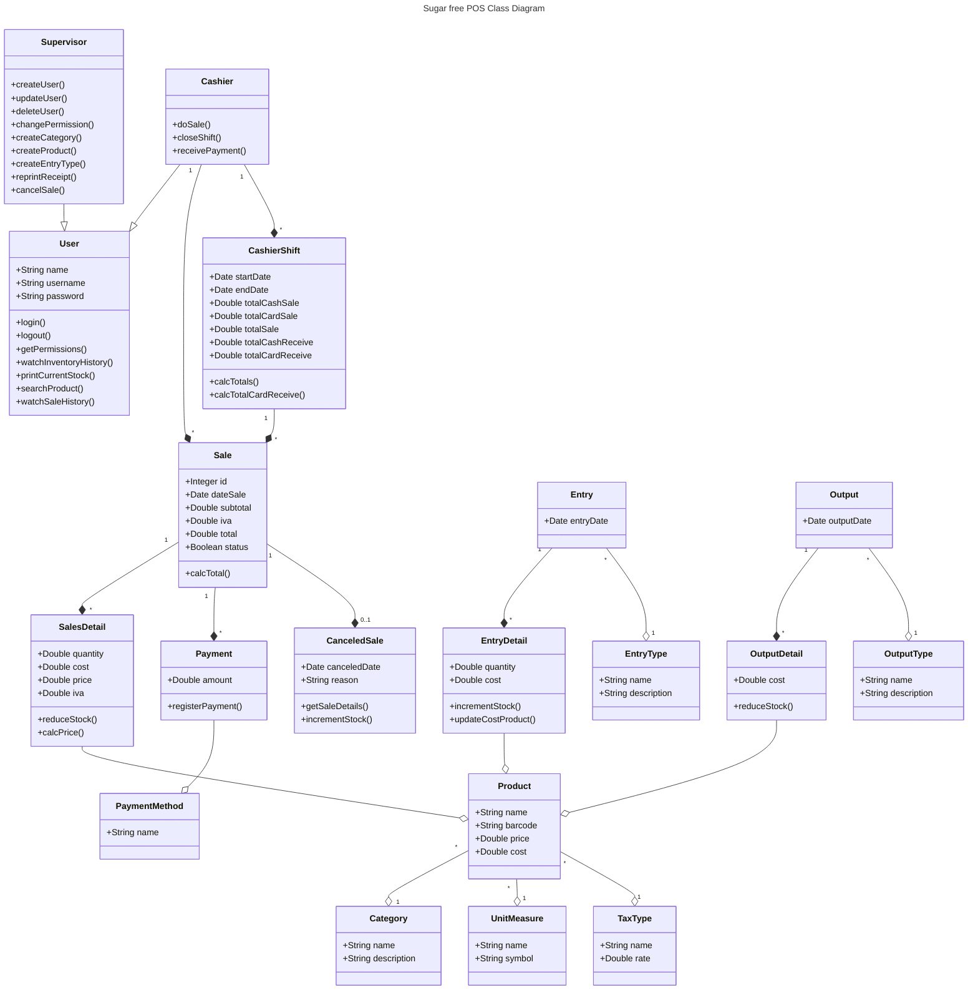
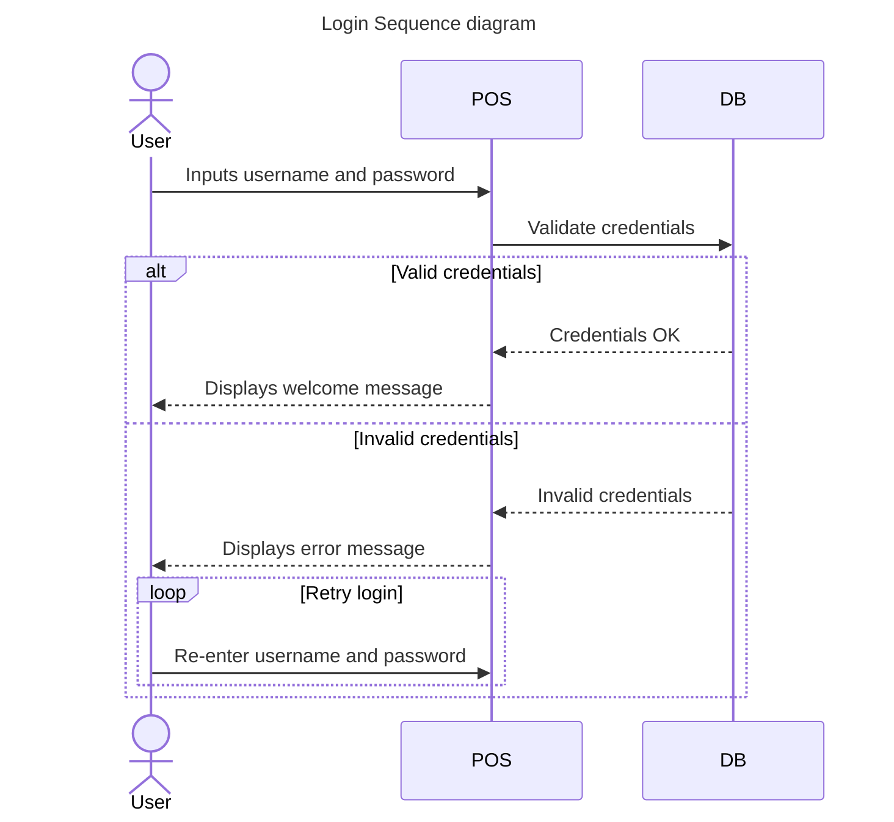
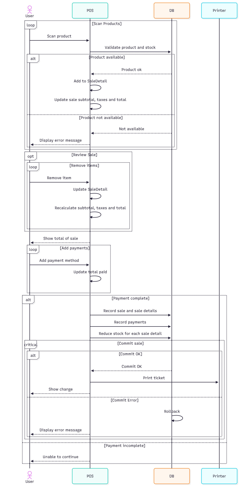
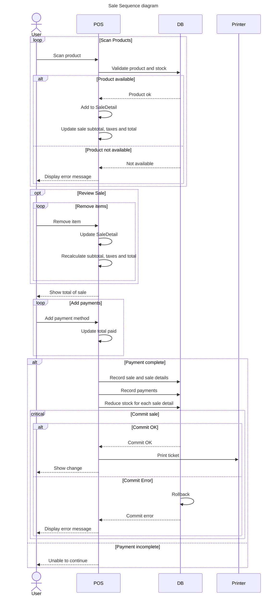
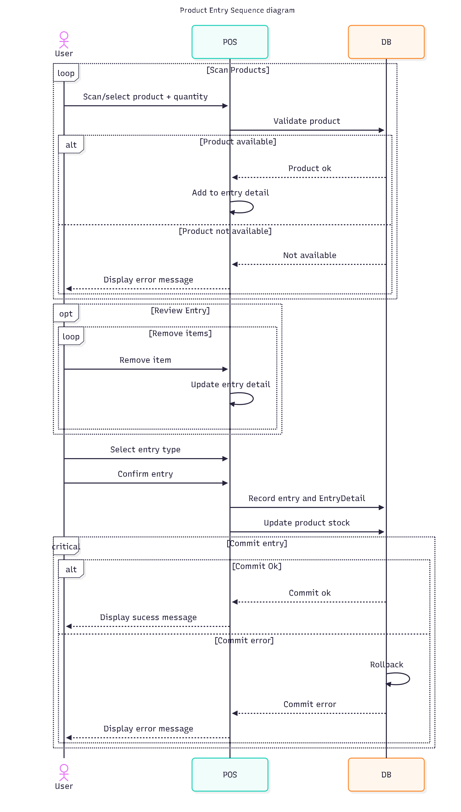
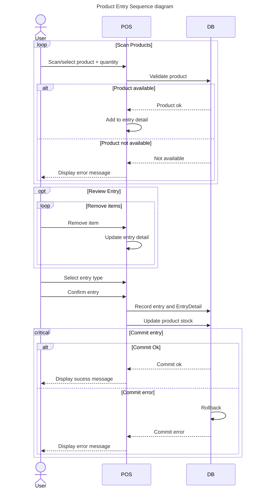
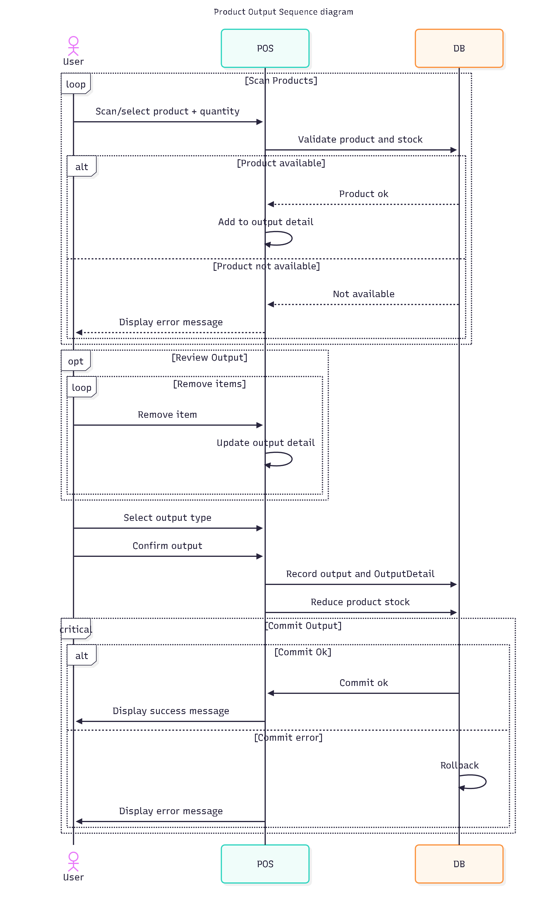
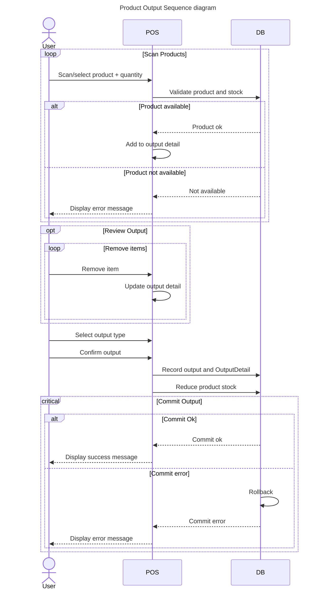
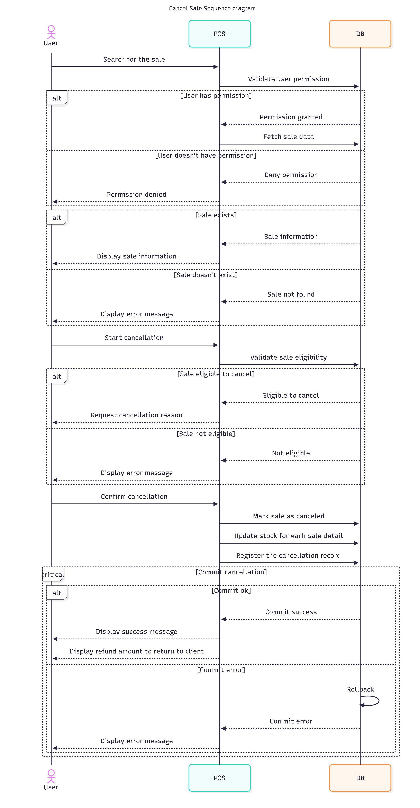
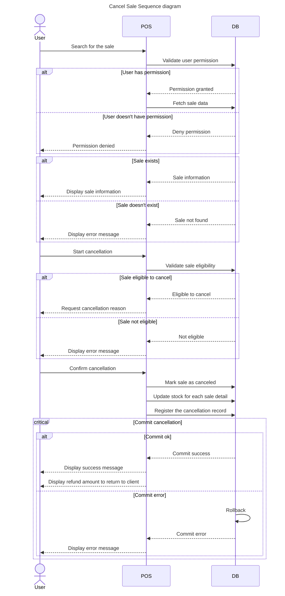

# System Design

<!-- ## Overview
This document describes the architecture and design of Sugar Free POS.
It includes class diagrams and sequence diagrams to explain how the system works. -->

## Overview

This document describes the architecture and design of Sugar Free POS.
It includes class diagrams and sequence diagrams to explain how the system works.

## Architecture

The system follows a simple 3-layer architecture:

- **Presentation Layer**: The UI (Forms or WPF) where users interact with the system.
- **Business Layer**: Contains the logic for sales, inventory, user management, and validation.
- **Data Layer**: Responsible for database access (SQLite) via repositories.

## Class Diagram

---

## Sequence diagrams

### Login

### Sales

### Product Entries

### Product Outputs

